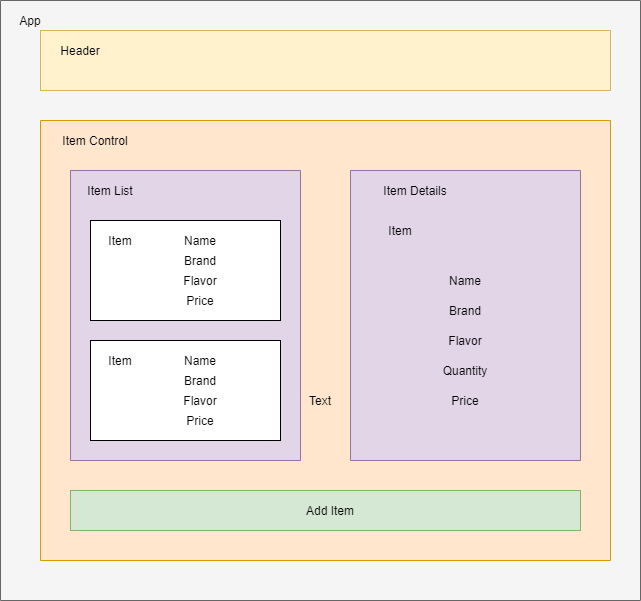

# Thirsty Tap Room

### A web application that helps tap rooms track their sells and inventory. April 24, 2020
#### _By: Hristo Dzhambov_

## Description

_A web application that is built in React to track taproom's inventory and the selections are listed by name, brand, flavor and price. The application helps the user to list the selection, add new items, see details and track how many pints are left in a keg._

## Component Tree

## Specifications
* The user is able to create, read, and update taps in the tap room.
* The user is able to submit a form to add a new kegs to a list.
* The user is able to click on a keg to see its detail page.
* The user is able to see how many pints are left in a keg.
* The user is able to sell a pint from the list and the quantity is reduced by 1.
* When the quantity of a tap reaches 0, the user will get a message "out of stock". A user should not be able to see quantity of a tap below 0.

## Setup/Installation Requirements

#### Node install

###### For macOS:
_If Homebrew is not installed on your computer already, then install Homebrew by entering the following two commands in Terminal:_
* $ /usr/bin/ruby -e "$(curl -fsSL https://raw.githubusercontent.com/Homebrew/install/master/install)"
* $ echo 'export PATH=/usr/local/bin:$PATH' >> ~/.bash_profile

_Install Git with the following command:_
* $ brew install git

_Next, install Node.js by entering the following command in Terminal:_
* $ brew install node

###### For Windows:
_Please visit the [Node.js website](https://nodejs.org/en/download/) for installation instructions._

#### Install this application

_Clone this repository via Terminal using the following commands:_
* _$ cd desktop_
* _$ git clone {https://github.com/dzhambov/Tap-Room-React}_
* _$ cd Tap-Room-React_
* _Confirm that you are in the correct directory by typing pwd_
* _Install npm at the project's root directory_
* _$ npm install_
* _$ npm run build_
* _$ npm install --save-exact react-scripts@3.2.0_

## Known Bugs

_There are no known bugs at this time._

## Support and Contact Details

_Have a bug or an issue with this application? [Open a new issue](https://github.com/dzhambov/Tap-Room-React/issues) here on GitHub._

## Technologies Used

* React
* JavaScript
* Webpack
* Git
* npm

### License

[MIT](https://choosealicense.com/licenses/mit/)

Copyright &copy; 2020 **_Hristo Dzhambov_** 